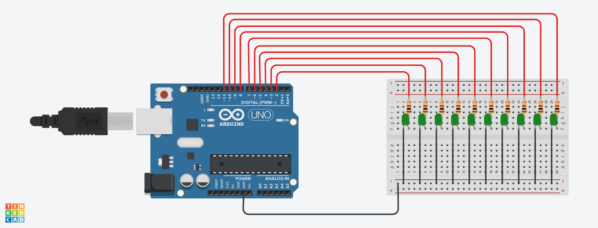
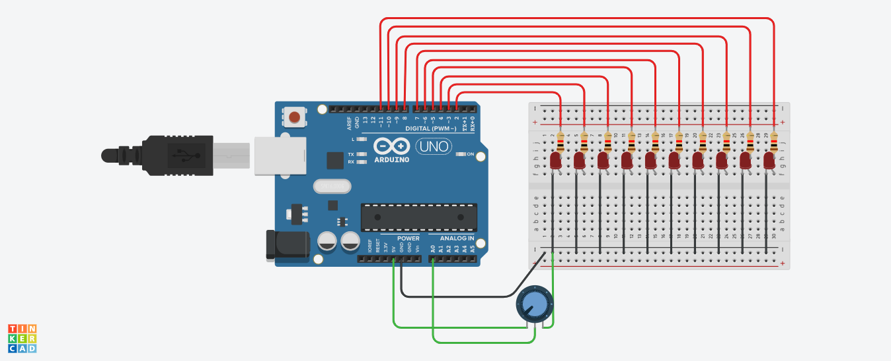

# Lab 1: Duyệt leds
## *Yêu cầu: 1, 2, 3*
*   Sáng dần theo thứ tự từ trái sang phải rồi tắt dần từ phải
về trái

*   Sáng dần từ hai bên vào trong rồi tắt dần từ trong ra hai
bên

*   Sáng lần lượt theo chẳn, lẻ
## *Mô phỏng: 1, 2, 3*

## *Yêu cầu: 5*
*   10 leds cùng sáng dần từ mờ tới rõ phụ thuộc vào giá trị đọc từ biến trở

## *Mô phỏng: 5*

